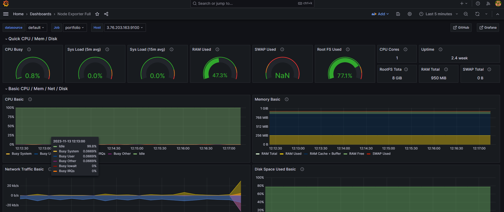
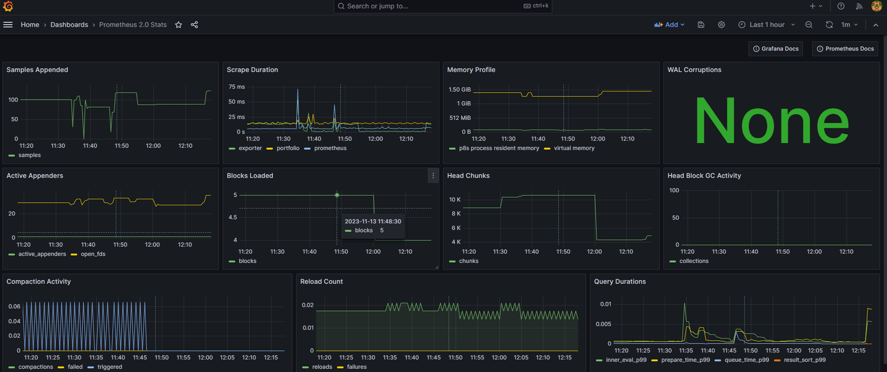

# Ü133 - Alerting

### Ziel

####  EC2 und SNS über Terraform erstellt
####  Grafana,Prometheus,alertmanager und node exporter wird über ansible instaliert und configuriert
####  Alertmanager von Prometheus integrieren. Das System konfigurieren und testen, sodass Prometheus einen Alarm an den Alertmanager schickt.
####  Der Alertmanager routet den Alert zum richtigen Empfänger, in unserem Fall ein eigens erstelltes SNS Topic mit dir als Mailempfänger.

---

